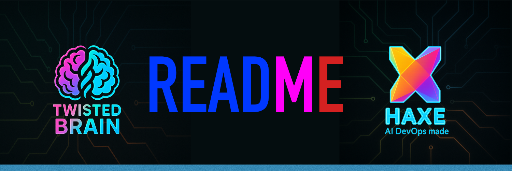

  

# Proof of Concept: Haxe AI Chat Application

## ::GOAL
The primary goal of this Proof of Concept (PoC) is to build a functional AI-powered chat application entirely with Haxe. This project will demonstrate Haxe's capability to handle both frontend and backend development for a modern web application.

## ::SCOPE
The application can be implemented in one of two ways, with different approaches to API key management:

1.  **100% Web App:** A single-page application (SPA) where the entire logic is handled client-side. In this model, the user provides their OpenRouter API key directly in the application's UI at runtime.
2.  **Web App with Backend:** A solution composed of a Haxe-based web frontend and a Haxe-based backend server. The backend acts as a secure gateway, using an API key stored in a server-side environment variable (`OPENROUTER_API_KEY`).

## ::REQUIREMENTS
- The application must be built using the Haxe programming language.
- It must integrate with the OpenRouter LLM gateway.
- **API Key Handling:**
    - For the **Web App with Backend** model, the backend server must retrieve the OpenRouter API key from the system's environment variable: `OPENROUTER_API_KEY`.
    - For the **100% Web App** model, the application must provide a mechanism for the user to input their API key at runtime. The key **must not** be stored in the project's source code or any other files within the repository.

## ::ARCHITECTURE
The project will follow the Hexagonal Architecture pattern to ensure a clean separation of concerns and high code reusability.

- **Shared Core Logic (`/domain`):** All platform-agnostic business logic, data models, and interfaces will reside in the `domain` directory. This code will be shared across all target platforms.
- **Platform-Specific Implementations (`/platform`):** This directory contains all platform-specific code, strictly organized into subdirectories for each target language. No source code files are allowed directly within the `platform`, `platform/core`, or `platform/frontend` directories.
    - **Backend (`/platform/core`):** Contains server-side implementations. All Haxe code for a specific backend target (e.g., JS, C#, PHP) **must** be placed in a corresponding subdirectory (e.g., `platform/core/js`, `platform/core/csharp`).
    - **Frontend (`/platform/frontend`):** Contains the client-side web application implementations. All Haxe source files, HTML, CSS, and other assets for a specific frontend target **must** be placed in a corresponding subdirectory (e.g., `platform/frontend/js`). The primary target for the web app is a React JS application compiled from Haxe.
- **Technology Stack:** The entire application will be coded in Haxe. External libraries can be used, either from Haxelib or specific to the target platform (e.g., npm packages for the React frontend).

## Chat UI Design
Use /Doc/React-UI.md

## App Design
**Single Page Application (SPA)** → A React-based web application where all views and components reside within the app itself, with client-side navigation handling all routing.

**Bundled Application with Embedded Assets** → During build time, all resources (JS, CSS, images, fonts, etc.) are compiled into a single set of static files (index.html + bundle.js + assets/).

**Online Only** → No service worker, no offline cache – the application loads all content from the web server each time, but feels like a "native" app in the browser because it doesn't reload between pages.

👉 **Summary:** A React Single Page Application (SPA) with embedded assets that runs fully online without offline caching capabilities.

## ::TESTING
This section outlines the testing strategy for the Haxe AI Chat Application, covering both the frontend and backend components. The goal is to ensure the application is robust, reliable, and provides a seamless user experience.

### ::TESTING_STRATEGY
A multi-layered testing approach will be adopted to validate the application's functionality, performance, and usability.

- **Unit Testing:** To verify the correctness of individual components, such as utility functions, UI components, and business logic modules.
- **Integration Testing:** To ensure that different parts of the application work together as expected. This includes testing the integration between the frontend and backend, as well as the integration with the OpenRouter API.
- **End-to-End (E2E) Testing:** To simulate real user scenarios and validate the complete application flow.

### ::TESTING_FRAMEWORKS
- **Frontend (React):**
    - **Jest:** A JavaScript testing framework for unit and integration testing of React components.
    - **React Testing Library:** A library for testing React components in a way that resembles how users interact with them.
- **Backend (Haxe):**
    - **Massive Unit:** A popular unit testing framework for Haxe.

### ::TEST_SCENARIOS
#### User Interface (UI) Testing
- **Component Rendering:** Verify that all UI components render correctly with different props and states.
- **User Interactions:** Test all user interactions, such as sending messages, receiving responses, and managing conversation history.
- **API Key Input:**
    - **100% Web App:** Test the input and validation of the OpenRouter API key provided by the user.
    - **Web App with Backend:** Verify that the frontend correctly communicates with the backend without exposing the API key.
- **Responsive Design:** Ensure the application is responsive and works seamlessly on different screen sizes.

#### AI and Backend Testing
- **API Integration:**
    - **OpenRouter:** Test the integration with the OpenRouter API, including sending requests and handling responses (both successful and error cases).
- **Business Logic:**
    - **Conversation Management:** Verify the logic for creating, storing, and retrieving conversations.
    - **AI Model Interaction:** Test the interaction with the AI model, including the handling of different message types and conversation contexts.
- **Security:**
    - **API Key Security (Backend Model):** Ensure the API key is securely stored and accessed on the backend, and not exposed to the client.

  

