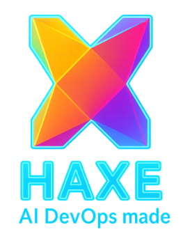

# Haxe Multi-Platform AI Application PoC

<div align="center">
  
</div>

## ::PROJECT_GOAL
This repository contains a Proof of Concept (PoC) for building a comprehensive, multi-platform AI application using the **Haxe** programming language. The primary objective is to demonstrate Haxe's power and flexibility in creating a unified codebase that can be deployed across various targets, including:

*   **Web (JavaScript/React)**
*   **Backend Servers (C++, Python, Java, C#, PHP, Neko)**
*   **Desktop and Mobile (via C++)**

The project follows a **Hexagonal Architecture** to ensure a clean separation between the core application logic (`domain`) and platform-specific implementations (`platform`).

## ::CORE_CONCEPT

<br>

## ::POC_SHOWCASE

Here is a snapshot of the running application—a simple, yet powerful chat interface built with Haxe and React, served by a C++ backend. This demonstrates the core value proposition: a single Haxe codebase delivering a complete, cross-platform solution.

<div align="center">
  
</div>

<br>
The foundational principle is **"Write Once, Reuse Everywhere."** A central `domain` directory holds all shared business logic, data models, and interfaces. This core is then connected to different platform "adapters" that handle the specifics of each target environment (e.g., handling HTTP requests in Node.js vs. Python).

## ::STRUCTURE
The repository is organized as follows:

- **`/PoC/`**: Contains detailed markdown documents for each specific Proof of Concept. Start here to understand the goals of each sub-project.
- **`/domain/`**: The shared, platform-agnostic core logic of the application. This is the heart of the project.
- **`/platform/`**: Contains the platform-specific code that adapts the `domain` core to different targets (e.g., JS for web, C++ for high-performance server).
- **`/docs/`**: High-level documentation covering architecture, design patterns, and project standards.
- **`/assets/`**: Shared assets like logos and images.

## ::BUILDING_AND_RUNNING

To build and run this project, follow these steps:

1.  **Install Dependencies**:
    Install the required Node.js packages.
    ```bash
    npm install
    ```

2.  **Build the C++ Backend**:
    Compile the Haxe code to a C++ executable.
    ```bash
    haxe build-backend.hxml
    ```

3.  **Build the Frontend**:
    Compile the Haxe frontend code and bundle it with Webpack.
    ```bash
    npx webpack
    ```

4.  **Copy Frontend Assets**:
    Copy the static HTML, CSS, and JS files to the `www` directory.
    ```bash
    npm run copy-frontend
    ```

5.  **Run the Server**:
    Start the C++ backend server, which will serve the frontend on `http://localhost:8080`.
    ```bash
    ./bin/server/BackendServer
    ```

6.  **Run End-to-End Tests**:
    Execute the E2E tests to verify the application is working correctly.
    ```bash
    npm run test:e2e
    ```

## ::GETTING_STARTED
1.  **Explore the Documentation**: Begin by reading the documents in the `/docs` and `/PoC` directories to understand the architecture and the different PoC goals.
2.  **Start with PoC 00**: The foundational project is `PoC/00-Haxe-AI-Chat-PoC.md`. All other PoCs build upon this baseline.


This project serves as a living document and a practical example of modern, cross-platform development with Haxe.

<div align="right">
  
</div>