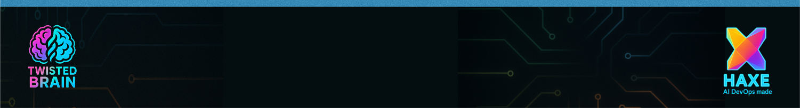

<div align="center">
  
</div>

## 🎯 Formål

En moderne AI chat-app i React med **lys/mørk tema**, **rolige neonfarver**, og **Twisted Brain logo** i toppen. Skal føles levende, men stadig rolig at se på.

---

## 🖼 Layout Canvas

```
+----------------------------------------------------+
| [logo.png] Twisted Brain        [Theme Toggle]     |  ← Header
+----------------------------------------------------+
|                                                    |
|   [Agent avatar]  ■ "Hello 👋"                     |
|                               ■ "Hi!" [User avatar]|
|   [Agent avatar]  ■ file.pdf [3.6 Mb]              |
|   [Agent avatar]  ■ "Look at this" + [📷 image]    |
|                               ■ "Oooow 😘" [User]  |
|                                                    |
+----------------------------------------------------+
|  ＋ [ input text area.................... ] [➤]    | ← Composer
+----------------------------------------------------+
```

---

## 🎨 Tema & Palet

* **Baggrund (dark):** #0C0F1A

* **Overflade:** #111529

* **Tekst:** #E9ECF8

* **Accentfarver:** Magenta `#FF49A8`, Cyan `#38E1FF`, Violet `#8A5BFF`

* **Glow:** `box-shadow: 0 0 24px rgba(accent,.35)`

* **Light tema:** inverteret, hvide overflader og mørk tekst, men samme accentfarver.

---

## 🧩 Komponenter

1. **Header**

   * Venstre: logo.png (28×28, glow-filter).
   * Midten: App-titel.
   * Højre: Tema-toggle (lys/mørk).

2. **MessageList**

   * Virtuel scroll.
   * Bobler:

     * User = højrejusteret, magenta glow.
     * Agent = venstrejusteret, cyan glow.
   * Indhold: tekst / billede / filchip.
   * Tidsstempel i hjørnet.

3. **Composer**

   * Attach-knap (`＋`).
   * Textarea (auto-expand, max 6 linjer).
   * Send-knap (`➤`, gradientkant magenta→cyan).

---

## 🔗 Datamodel

```ts
type Sender = 'user' | 'agent' | 'system';

type Content =
  | { kind: 'text'; text: string }
  | { kind: 'image'; url: string; alt?: string }
  | { kind: 'file'; name: string; size: number; url: string };

interface Message {
  id: string;
  sender: Sender;
  content: Content[];
  createdAt: string;
  status?: 'sending' | 'sent' | 'error';
}
```

---

## ⚙️ Interaktion

* Autoscroll til nyeste, men “jump to latest” når user har scrollet op.
* `sending` = halvtransparent boble.
* `error` = rød chip + retry.
* Typing indicator efter 250ms.
* **Hotkeys:** ⌘/Ctrl+Enter = send, Shift+Enter = ny linje.

---

## 📂 Assets

* `/assets/logo.png` 
* `/assets/tb.png`
* `/assets/tb_3.png`
* `/assets/tb_4.png`
* `/assets/tb_5.png`
* Favicon genereres fra logo.

---

## 🛠 Stack

* **React + Vite + TS**
* **Virtuel liste** (f.eks. react-virtuoso).
* **CSS-in-JS** eller Tailwind, valgfrit.
* State mgmt: useState + context.

---

👉 Denne **Canvas doc** er tænkt som ét ark du kan give direkte til en AI-Dev-coder – så har de **UX-flowet, farverne, komponenttræet, datamodellen, og interaktionskravene** på ét sted uden at skulle tolke.

<div align="center">
  
</div>
